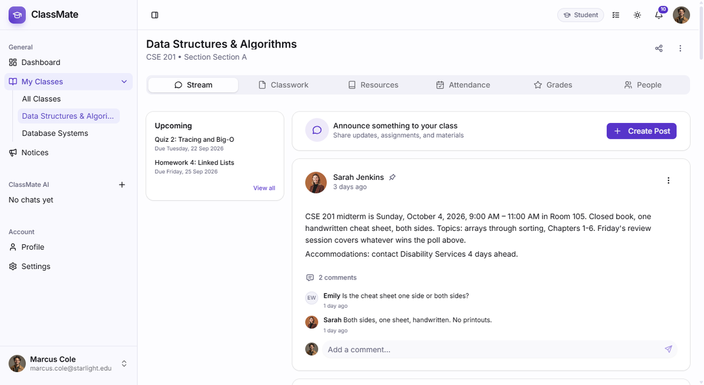
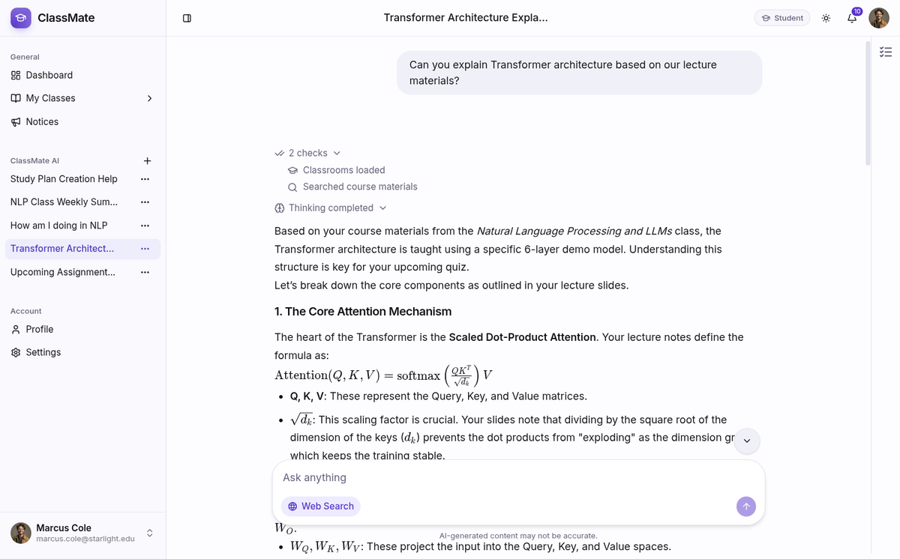
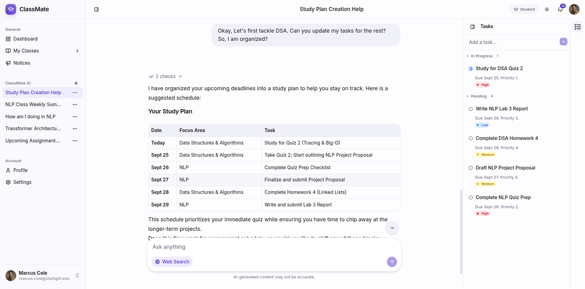

# ClassMate Client

One place for classes, assignments, grades, notices, and AI study help, with dashboards for admins, instructors, and students.

[](https://nextjs.org)


Backend: [ReactiveX22/classmate-backend](https://github.com/ReactiveX22/classmate-backend)

## Where it started

Classes were spread across chat groups and drives. This UI puts each role where it needs to be:

* Admin: totals, directories, course catalog and enrollment, sessions, notices, bulk import, impersonation
* Instructor: classrooms, posts and assignments, submissions and grading, attendance, resources
* Student: stream, assignment submit, grades, attendance summary, resources, notices, tasks
* Everyone: realtime notifications plus AI chat grounded in their own materials

## What it looks like in use






## Stack

| Layer | Choice |
|---|---|
| App | Next.js 16 App Router, React 19, TypeScript |
| UI | Tailwind CSS 4, shadcn/ui, Tiptap editors |
| Data | TanStack Query, Table, Form, Zod schemas |
| Auth | Better-Auth client |
| Realtime | Socket.IO client |

## Features

* Dashboards switch by role with sidebars, stats cards, upcoming work, and recent notices (`src/app/(main)/dashboard`)
* Classroom workspace with stream, classwork, people, grades, and attendance tabs. Posts cover announcement, assignment, material, and question with attachments (`src/components/classrooms`)
* Assignments show instructions, points, due date, and files. Students submit text or links. Instructors grade and return submissions one by one or in bulk (`src/app/(main)/dashboard/classrooms/[id]/assignments`)
* Attendance records present, absent, and late with notes and totals. Resources support search by title and content plus bookmarking
* Notices list with search, formatted read view, and attachments. Header popover shows unread items and links to the classroom or notice, with browser notifications and mark read or all read
* AI chat streams content with tool and reasoning indicators, retry, per-conversation threads, Web Search toggle, and a Tasks panel for personal todos (`src/components/ai`)
* Join via QR, link, or class code at `/join/[code]` with preview, login redirect, and student-only join (`src/app/join/[code]/page.tsx`)

## Implementation

* AI deltas batch through requestAnimationFrame with min-display tool states, abort, and retry, committed straight into the Query cache (`src/hooks/use-ai-chat.ts`)
* Authoring uses Tiptap rich and block editors. Reading uses the static renderer so posts render fast and safe (`src/components/editor`, `src/components/block-editor`)
* One socket connects in the dashboard layout, then fans out to toasts, browser notifications, and in-place list updates without refetch (`src/lib/api/services/socket.service.ts`)

## How data flows

App Router renders static parts on the server and interactive parts on the client. TanStack Query holds per-entity caches with optimistic writes to `/api/v1`. Socket.IO pushes live notifications into the same cache.

Auth uses Better-Auth client with role and org fields, guarded by `src/proxy.ts` (`/dashboard` protected, auth routes redirect when sessioned). Next rewrites `/api/:path*` to `API_URL` (local `http://localhost:3000`). Sockets use `NEXT_PUBLIC_SOCKET_URL` with credentials.

## Quickstart

```bash
pnpm install
cp .env.example .env   # set API_URL, NEXT_PUBLIC_SOCKET_URL
pnpm dev               # app at http://localhost:3001
```

<details>
<summary>More commands</summary>

```bash
pnpm build && pnpm start  # production on port 3001
pnpm test                 # vitest
pnpm lint                 # eslint
pnpm typecheck            # tsc --noEmit
```

Needs the backend running on port 3000 first. See `.env.example` for `API_URL`, `NEXT_PUBLIC_SOCKET_URL`, `NEXT_PUBLIC_SITE_URL`.
</details>

## Why built this way

App Router with route groups for landing, auth, and dashboard so role layouts stay separate. TanStack Query instead of server-only fetch so classroom lists, notifications, and AI messages update in place. Single socket instead of per-page connects to keep rooms (`org`, `class`) and cache writes in one spot.

Pushing to `main` builds and publishes Docker to GHCR.
